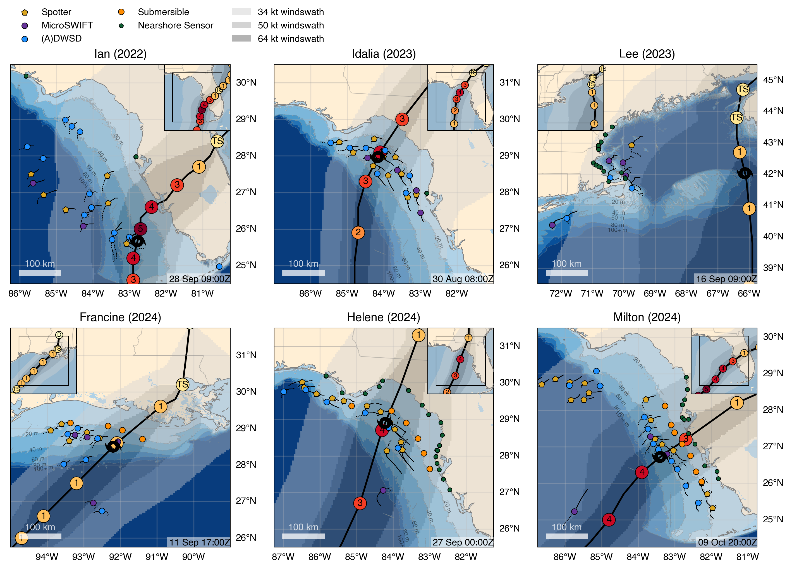

# nhci-bams-maps

Maps for the NOPP Hurricane Coastal Impacts project BAMS article.  See figures in the [maps](./maps/) folder.

See [https://nopphurricane.sofarocean.com/](https://nopphurricane.sofarocean.com/) for more information on the project.

